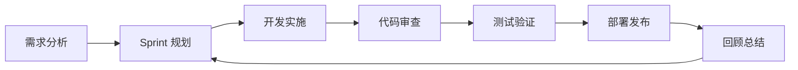

# AIOps 项目完善实施计划和时间表

## 📋 项目概览

**计划制定日期**: 2025-01-19  
**计划执行周期**: 12周 (2025-01-20 至 2025-04-13)  
**项目当前成熟度**: 6.8/10  
**目标成熟度**: 8.5/10  
**预计投入**: 3-4人月  

---

## 🎯 总体目标

### 核心目标
1. **提升系统稳定性**: 从 7/10 提升至 9/10
2. **增强安全性**: 从 6/10 提升至 9/10  
3. **完善自动化**: 从 5/10 提升至 8/10
4. **优化性能**: 从 7/10 提升至 8/10
5. **改善可维护性**: 从 6/10 提升至 8/10

### 成功指标
- 系统可用性 > 99.5%
- 平均故障恢复时间 < 5分钟
- 代码覆盖率 > 80%
- 安全漏洞数量 = 0 (高危)
- 部署频率 > 每周2次
- 变更失败率 < 5%

---

## 📅 详细实施计划

## 第一阶段：基础设施完善 (第1-3周)

### 🔴 Week 1: CI/CD 流水线建设

#### 任务1.1: GitHub Actions 工作流配置 (3天)
**负责人**: DevOps 工程师  
**优先级**: 🔴 高  

**详细步骤**:
1. **Day 1**: 创建基础 CI 工作流
   ```bash
   # 创建工作流目录
   mkdir -p .github/workflows
   
   # 创建 CI 配置文件
   touch .github/workflows/ci.yml
   touch .github/workflows/cd.yml
   touch .github/workflows/security-scan.yml
   ```

2. **Day 2**: 配置代码质量检查
   - ESLint 配置和规则
   - Prettier 代码格式化
   - TypeScript 类型检查
   - SonarQube 集成

3. **Day 3**: 集成安全扫描
   - Trivy 漏洞扫描
   - Snyk 依赖检查
   - CodeQL 代码分析
   - SAST/DAST 工具集成

**交付物**:
- [ ] `.github/workflows/ci.yml` - 持续集成工作流
- [ ] `.github/workflows/cd.yml` - 持续部署工作流  
- [ ] `.github/workflows/security-scan.yml` - 安全扫描工作流
- [ ] `eslint.config.js` - ESLint 配置
- [ ] `.prettierrc` - Prettier 配置

**验收标准**:
- [ ] 所有工作流能够成功执行
- [ ] 代码质量检查通过率 > 95%
- [ ] 安全扫描无高危漏洞
- [ ] 构建时间 < 10分钟

#### 任务1.2: 自动化测试集成 (2天)
**负责人**: 测试工程师  
**优先级**: 🔴 高  

**详细步骤**:
1. **Day 1**: 单元测试框架搭建
   ```bash
   # 前端测试
   npm install --save-dev jest @testing-library/react @testing-library/jest-dom
   
   # 后端测试
   pip install pytest pytest-cov pytest-mock
   ```

2. **Day 2**: 集成测试和E2E测试
   ```bash
   # E2E 测试
   npm install --save-dev playwright @playwright/test
   
   # API 测试
   pip install pytest-httpx requests-mock
   ```

**交付物**:
- [ ] `jest.config.js` - Jest 测试配置
- [ ] `pytest.ini` - Pytest 配置
- [ ] `playwright.config.ts` - Playwright 配置
- [ ] `tests/` - 测试用例目录结构

**验收标准**:
- [ ] 单元测试覆盖率 > 70%
- [ ] 集成测试覆盖核心业务流程
- [ ] E2E 测试覆盖关键用户路径
- [ ] 测试执行时间 < 15分钟

#### 任务1.3: 容器化和部署优化 (2天)
**负责人**: DevOps 工程师  
**优先级**: 🟡 中  

**详细步骤**:
1. **Day 1**: Dockerfile 优化
   - 多阶段构建
   - 安全基础镜像
   - 非特权用户
   - 健康检查

2. **Day 2**: Docker Compose 增强
   - 资源限制
   - 网络隔离
   - 卷管理
   - 环境变量管理

**交付物**:
- [ ] 优化的 `Dockerfile` 文件
- [ ] 增强的 `docker-compose.yml`
- [ ] `docker-compose.override.yml` 开发环境配置
- [ ] `.dockerignore` 文件

**验收标准**:
- [ ] 镜像大小减少 > 30%
- [ ] 容器启动时间 < 30秒
- [ ] 安全扫描无高危漏洞
- [ ] 健康检查正常工作

### 🟡 Week 2: 备份恢复系统

#### 任务2.1: 自动化备份脚本开发 (3天)
**负责人**: 系统管理员  
**优先级**: 🔴 高  

**详细步骤**:
1. **Day 1**: 数据库备份脚本
   ```bash
   # 创建备份脚本目录
   mkdir -p scripts/backup
   
   # 数据库备份脚本
   touch scripts/backup/database-backup.sh
   touch scripts/backup/mongodb-backup.sh
   touch scripts/backup/redis-backup.sh
   ```

2. **Day 2**: 配置和应用数据备份
   ```bash
   # 配置备份脚本
   touch scripts/backup/config-backup.sh
   touch scripts/backup/application-backup.sh
   ```

3. **Day 3**: 云存储集成和加密
   ```bash
   # 云存储脚本
   touch scripts/backup/cloud-sync.sh
   touch scripts/backup/encryption.sh
   ```

**交付物**:
- [ ] `scripts/backup/comprehensive-backup-system.sh` - 主备份脚本
- [ ] `scripts/backup/restore-system.sh` - 恢复脚本
- [ ] `configs/backup-config.yml` - 备份配置
- [ ] `cron.d/backup-schedule` - 定时任务配置

**验收标准**:
- [ ] 备份成功率 > 99%
- [ ] 备份验证通过率 100%
- [ ] 恢复测试成功
- [ ] 备份时间 < 30分钟

#### 任务2.2: 备份验证和恢复测试 (2天)
**负责人**: 系统管理员  
**优先级**: 🟡 中  

**详细步骤**:
1. **Day 1**: 备份完整性验证
   - 文件完整性检查
   - 数据库备份验证
   - 加密验证

2. **Day 2**: 恢复流程测试
   - 完整恢复测试
   - 部分恢复测试
   - 跨环境恢复测试

**交付物**:
- [ ] `scripts/backup/verify-backup.sh` - 备份验证脚本
- [ ] `scripts/backup/test-restore.sh` - 恢复测试脚本
- [ ] `docs/backup-recovery-guide.md` - 备份恢复指南

**验收标准**:
- [ ] 备份验证自动化
- [ ] 恢复时间 < 1小时
- [ ] 恢复成功率 100%
- [ ] 文档完整准确

### 🟡 Week 3: 监控告警优化

#### 任务3.1: 智能监控规则配置 (3天)
**负责人**: 监控工程师  
**优先级**: 🟡 中  

**详细步骤**:
1. **Day 1**: Prometheus 规则优化
   ```yaml
   # 创建监控规则目录
   mkdir -p monitoring/prometheus/rules
   
   # 创建规则文件
   touch monitoring/prometheus/rules/application.yml
   touch monitoring/prometheus/rules/infrastructure.yml
   touch monitoring/prometheus/rules/business.yml
   ```

2. **Day 2**: Grafana 仪表板优化
   ```bash
   # 仪表板配置
   mkdir -p monitoring/grafana/dashboards
   touch monitoring/grafana/dashboards/overview.json
   touch monitoring/grafana/dashboards/application.json
   ```

3. **Day 3**: Alertmanager 告警路由
   ```yaml
   # 告警配置
   touch monitoring/alertmanager/alertmanager.yml
   touch monitoring/alertmanager/notification-templates.yml
   ```

**交付物**:
- [ ] `monitoring/prometheus/rules/` - Prometheus 告警规则
- [ ] `monitoring/grafana/dashboards/` - Grafana 仪表板
- [ ] `monitoring/alertmanager/alertmanager.yml` - 告警管理配置
- [ ] `monitoring/blackbox/blackbox.yml` - 黑盒监控配置

**验收标准**:
- [ ] 告警响应时间 < 1分钟
- [ ] 误报率 < 5%
- [ ] 监控覆盖率 > 90%
- [ ] 仪表板加载时间 < 3秒

#### 任务3.2: 日志分析增强 (2天)
**负责人**: 监控工程师  
**优先级**: 🟡 中  

**详细步骤**:
1. **Day 1**: ELK 配置优化
   - Logstash 过滤器优化
   - Elasticsearch 索引模板
   - Kibana 可视化配置

2. **Day 2**: 日志异常检测
   - 异常模式识别
   - 自动告警集成
   - 日志聚合分析

**交付物**:
- [ ] `elk/logstash/pipeline/` - Logstash 管道配置
- [ ] `elk/elasticsearch/templates/` - ES 索引模板
- [ ] `elk/kibana/saved-objects/` - Kibana 保存对象
- [ ] `scripts/log-analysis/` - 日志分析脚本

**验收标准**:
- [ ] 日志处理延迟 < 10秒
- [ ] 异常检测准确率 > 85%
- [ ] 日志保留策略生效
- [ ] 搜索响应时间 < 2秒

---

## 第二阶段：安全性增强 (第4-6周)

### 🔴 Week 4: 安全配置加固

#### 任务4.1: 容器安全加固 (3天)
**负责人**: 安全工程师  
**优先级**: 🔴 高  

**详细步骤**:
1. **Day 1**: 基础镜像安全
   ```dockerfile
   # 安全基础镜像选择
   FROM node:18-alpine AS base
   
   # 创建非特权用户
   RUN addgroup -g 1001 -S nodejs
   RUN adduser -S nextjs -u 1001
   ```

2. **Day 2**: 运行时安全配置
   ```yaml
   # Pod 安全上下文
   securityContext:
     runAsNonRoot: true
     runAsUser: 1001
     readOnlyRootFilesystem: true
     allowPrivilegeEscalation: false
   ```

3. **Day 3**: 网络安全策略
   ```yaml
   # 网络策略配置
   apiVersion: networking.k8s.io/v1
   kind: NetworkPolicy
   metadata:
     name: aiops-network-policy
   ```

**交付物**:
- [ ] `security/docker/` - Docker 安全配置
- [ ] `security/kubernetes/` - K8s 安全策略
- [ ] `security/network-policies/` - 网络策略
- [ ] `security/pod-security-policies/` - Pod 安全策略

**验收标准**:
- [ ] 容器安全扫描通过
- [ ] 网络隔离生效
- [ ] 权限最小化原则
- [ ] 安全基线合规

#### 任务4.2: 身份认证和授权 (2天)
**负责人**: 后端工程师  
**优先级**: 🔴 高  

**详细步骤**:
1. **Day 1**: JWT 安全增强
   ```javascript
   // JWT 配置优化
   const jwtConfig = {
     algorithm: 'RS256',
     expiresIn: '15m',
     issuer: 'aiops-api',
     audience: 'aiops-client'
   };
   ```

2. **Day 2**: RBAC 权限控制
   ```javascript
   // 角色权限配置
   const permissions = {
     admin: ['*'],
     operator: ['read', 'execute'],
     viewer: ['read']
   };
   ```

**交付物**:
- [ ] `src/auth/` - 认证授权模块
- [ ] `configs/rbac.yml` - RBAC 配置
- [ ] `src/middleware/auth.js` - 认证中间件
- [ ] `docs/security-guide.md` - 安全使用指南

**验收标准**:
- [ ] 认证成功率 > 99.9%
- [ ] 权限控制精确
- [ ] 会话管理安全
- [ ] 审计日志完整

#### 任务4.3: 数据加密和密钥管理 (2天)
**负责人**: 安全工程师  
**优先级**: 🟡 中  

**详细步骤**:
1. **Day 1**: 数据库加密
   ```sql
   -- 数据库加密配置
   ALTER DATABASE aiops SET encryption = 'on';
   ```

2. **Day 2**: 密钥管理系统
   ```bash
   # Vault 配置
   vault auth enable kubernetes
   vault policy write aiops-policy - <<EOF
   path "secret/data/aiops/*" {
     capabilities = ["read"]
   }
   EOF
   ```

**交付物**:
- [ ] `security/encryption/` - 加密配置
- [ ] `security/vault/` - Vault 配置
- [ ] `scripts/key-rotation.sh` - 密钥轮转脚本
- [ ] `docs/encryption-guide.md` - 加密指南

**验收标准**:
- [ ] 敏感数据全加密
- [ ] 密钥轮转自动化
- [ ] 加密性能影响 < 10%
- [ ] 合规性检查通过

### 🟡 Week 5: 安全扫描和合规

#### 任务5.1: 自动化安全扫描 (3天)
**负责人**: 安全工程师  
**优先级**: 🔴 高  

**详细步骤**:
1. **Day 1**: 代码安全扫描
   ```yaml
   # CodeQL 配置
   name: "CodeQL"
   on:
     push:
       branches: [ main ]
     pull_request:
       branches: [ main ]
   ```

2. **Day 2**: 依赖漏洞扫描
   ```bash
   # Snyk 集成
   npm install -g snyk
   snyk auth $SNYK_TOKEN
   snyk test --severity-threshold=high
   ```

3. **Day 3**: 基础设施扫描
   ```bash
   # Trivy 扫描
   trivy fs --security-checks vuln,config .
   trivy image aiops:latest
   ```

**交付物**:
- [ ] `.github/workflows/security-scan.yml` - 安全扫描工作流
- [ ] `security/scanners/` - 扫描器配置
- [ ] `security/policies/` - 安全策略
- [ ] `reports/security/` - 安全报告

**验收标准**:
- [ ] 扫描覆盖率 100%
- [ ] 高危漏洞数量 = 0
- [ ] 扫描时间 < 15分钟
- [ ] 报告自动生成

#### 任务5.2: 合规性检查 (2天)
**负责人**: 合规专员  
**优先级**: 🟡 中  

**详细步骤**:
1. **Day 1**: GDPR 合规检查
   - 数据处理记录
   - 隐私政策更新
   - 数据主体权利

2. **Day 2**: SOC2 合规准备
   - 访问控制审计
   - 数据保护措施
   - 监控日志记录

**交付物**:
- [ ] `compliance/gdpr/` - GDPR 合规文档
- [ ] `compliance/soc2/` - SOC2 合规文档
- [ ] `docs/privacy-policy.md` - 隐私政策
- [ ] `docs/data-processing-record.md` - 数据处理记录

**验收标准**:
- [ ] 合规检查通过
- [ ] 文档完整准确
- [ ] 审计跟踪完整
- [ ] 风险评估完成

### 🟡 Week 6: 安全运维集成

#### 任务6.1: 安全事件响应 (2天)
**负责人**: 安全工程师  
**优先级**: 🟡 中  

**详细步骤**:
1. **Day 1**: 事件检测和告警
   ```yaml
   # 安全事件告警规则
   groups:
   - name: security.rules
     rules:
     - alert: SuspiciousActivity
       expr: rate(failed_login_attempts[5m]) > 10
   ```

2. **Day 2**: 响应流程自动化
   ```bash
   # 自动响应脚本
   #!/bin/bash
   # incident-response.sh
   
   case $1 in
     "brute_force")
       # 自动封禁IP
       iptables -A INPUT -s $2 -j DROP
       ;;
   esac
   ```

**交付物**:
- [ ] `security/incident-response/` - 事件响应脚本
- [ ] `security/playbooks/` - 响应手册
- [ ] `monitoring/security-rules.yml` - 安全监控规则
- [ ] `docs/incident-response-plan.md` - 响应计划

**验收标准**:
- [ ] 事件检测时间 < 5分钟
- [ ] 自动响应成功率 > 90%
- [ ] 响应时间 < 15分钟
- [ ] 事件记录完整

#### 任务6.2: 安全培训和文档 (3天)
**负责人**: 安全工程师  
**优先级**: 🟢 低  

**详细步骤**:
1. **Day 1**: 安全开发指南
2. **Day 2**: 运维安全手册
3. **Day 3**: 安全培训材料

**交付物**:
- [ ] `docs/security-development-guide.md` - 安全开发指南
- [ ] `docs/security-operations-manual.md` - 安全运维手册
- [ ] `training/security-awareness/` - 安全意识培训
- [ ] `docs/security-checklist.md` - 安全检查清单

**验收标准**:
- [ ] 文档覆盖全面
- [ ] 培训材料实用
- [ ] 检查清单可操作
- [ ] 团队培训完成

---

## 第三阶段：性能优化 (第7-9周)

### 🟡 Week 7: 应用性能优化

#### 任务7.1: 前端性能优化 (3天)
**负责人**: 前端工程师  
**优先级**: 🟡 中  

**详细步骤**:
1. **Day 1**: 代码分割和懒加载
   ```javascript
   // 路由懒加载
   const Dashboard = lazy(() => import('./pages/Dashboard'));
   const Analytics = lazy(() => import('./pages/Analytics'));
   ```

2. **Day 2**: 资源优化
   ```javascript
   // Webpack 配置优化
   module.exports = {
     optimization: {
       splitChunks: {
         chunks: 'all',
         cacheGroups: {
           vendor: {
             test: /[\\/]node_modules[\\/]/,
             name: 'vendors',
             chunks: 'all',
           },
         },
       },
     },
   };
   ```

3. **Day 3**: 缓存策略优化
   ```javascript
   // Service Worker 缓存
   const CACHE_NAME = 'aiops-v1';
   const urlsToCache = [
     '/',
     '/static/js/bundle.js',
     '/static/css/main.css',
   ];
   ```

**交付物**:
- [ ] 优化的 Webpack 配置
- [ ] Service Worker 实现
- [ ] 图片优化脚本
- [ ] 性能监控集成

**验收标准**:
- [ ] 首屏加载时间 < 2秒
- [ ] 包大小减少 > 30%
- [ ] Lighthouse 评分 > 90
- [ ] 缓存命中率 > 80%

#### 任务7.2: 后端性能优化 (2天)
**负责人**: 后端工程师  
**优先级**: 🟡 中  

**详细步骤**:
1. **Day 1**: 数据库查询优化
   ```sql
   -- 索引优化
   CREATE INDEX CONCURRENTLY idx_users_email ON users(email);
   CREATE INDEX CONCURRENTLY idx_logs_timestamp ON logs(timestamp DESC);
   ```

2. **Day 2**: API 响应优化
   ```python
   # 缓存装饰器
   @cache.memoize(timeout=300)
   def get_dashboard_data(user_id):
       return dashboard_service.get_data(user_id)
   ```

**交付物**:
- [ ] 数据库索引优化
- [ ] API 缓存实现
- [ ] 连接池配置
- [ ] 性能监控集成

**验收标准**:
- [ ] API 响应时间 < 200ms
- [ ] 数据库查询时间 < 50ms
- [ ] 并发处理能力 > 1000 RPS
- [ ] 内存使用优化 > 20%

#### 任务7.3: 数据库性能调优 (2天)
**负责人**: 数据库管理员  
**优先级**: 🟡 中  

**详细步骤**:
1. **Day 1**: PostgreSQL 调优
   ```sql
   -- 配置优化
   ALTER SYSTEM SET shared_buffers = '256MB';
   ALTER SYSTEM SET effective_cache_size = '1GB';
   ALTER SYSTEM SET work_mem = '4MB';
   ```

2. **Day 2**: MongoDB 调优
   ```javascript
   // 索引优化
   db.logs.createIndex({ "timestamp": -1, "level": 1 });
   db.users.createIndex({ "email": 1 }, { unique: true });
   ```

**交付物**:
- [ ] 数据库配置优化
- [ ] 索引策略文档
- [ ] 查询优化脚本
- [ ] 性能监控仪表板

**验收标准**:
- [ ] 查询性能提升 > 50%
- [ ] 索引命中率 > 95%
- [ ] 连接池利用率优化
- [ ] 慢查询数量 < 1%

### 🟡 Week 8: 系统性能监控

#### 任务8.1: APM 集成 (3天)
**负责人**: 监控工程师  
**优先级**: 🟡 中  

**详细步骤**:
1. **Day 1**: 应用性能监控
   ```javascript
   // New Relic 集成
   require('newrelic');
   
   // 自定义指标
   newrelic.recordMetric('Custom/API/Response', responseTime);
   ```

2. **Day 2**: 分布式追踪
   ```python
   # Jaeger 追踪
   from jaeger_client import Config
   
   config = Config(
       config={
           'sampler': {'type': 'const', 'param': 1},
           'logging': True,
       },
       service_name='aiops-api',
   )
   ```

3. **Day 3**: 性能基线建立
   ```yaml
   # 性能基线配置
   performance_baselines:
     api_response_time: 200ms
     database_query_time: 50ms
     memory_usage: 512MB
     cpu_usage: 70%
   ```

**交付物**:
- [ ] APM 工具集成
- [ ] 分布式追踪配置
- [ ] 性能基线文档
- [ ] 性能告警规则

**验收标准**:
- [ ] 性能数据收集完整
- [ ] 追踪覆盖率 > 90%
- [ ] 性能基线准确
- [ ] 告警及时有效

#### 任务8.2: 容量规划 (2天)
**负责人**: 系统架构师  
**优先级**: 🟡 中  

**详细步骤**:
1. **Day 1**: 资源使用分析
   ```bash
   # 资源监控脚本
   #!/bin/bash
   # capacity-analysis.sh
   
   # CPU 使用率趋势
   sar -u 1 3600 > cpu-usage.log
   
   # 内存使用趋势
   sar -r 1 3600 > memory-usage.log
   ```

2. **Day 2**: 扩容策略制定
   ```yaml
   # HPA 配置
   apiVersion: autoscaling/v2
   kind: HorizontalPodAutoscaler
   metadata:
     name: aiops-hpa
   spec:
     minReplicas: 2
     maxReplicas: 10
     targetCPUUtilizationPercentage: 70
   ```

**交付物**:
- [ ] 容量分析报告
- [ ] 扩容策略文档
- [ ] HPA 配置
- [ ] 成本优化建议

**验收标准**:
- [ ] 容量预测准确率 > 85%
- [ ] 扩容策略可执行
- [ ] 成本优化 > 15%
- [ ] 资源利用率 > 75%

### 🟡 Week 9: 性能测试和调优

#### 任务9.1: 压力测试 (3天)
**负责人**: 测试工程师  
**优先级**: 🟡 中  

**详细步骤**:
1. **Day 1**: 负载测试
   ```javascript
   // K6 负载测试
   import http from 'k6/http';
   import { check } from 'k6';
   
   export let options = {
     stages: [
       { duration: '2m', target: 100 },
       { duration: '5m', target: 100 },
       { duration: '2m', target: 200 },
       { duration: '5m', target: 200 },
       { duration: '2m', target: 0 },
     ],
   };
   ```

2. **Day 2**: 压力测试
   ```bash
   # JMeter 压力测试
   jmeter -n -t stress-test.jmx -l results.jtl -e -o report/
   ```

3. **Day 3**: 性能瓶颈分析
   ```python
   # 性能分析脚本
   import cProfile
   import pstats
   
   profiler = cProfile.Profile()
   profiler.enable()
   # 执行代码
   profiler.disable()
   stats = pstats.Stats(profiler)
   stats.sort_stats('cumulative').print_stats(10)
   ```

**交付物**:
- [ ] 负载测试脚本
- [ ] 压力测试报告
- [ ] 性能瓶颈分析
- [ ] 优化建议文档

**验收标准**:
- [ ] 系统承载能力明确
- [ ] 性能瓶颈识别准确
- [ ] 优化效果可量化
- [ ] 测试可重复执行

#### 任务9.2: 性能调优实施 (2天)
**负责人**: 全栈工程师  
**优先级**: 🟡 中  

**详细步骤**:
1. **Day 1**: 代码层面优化
   - 算法优化
   - 内存管理
   - 并发处理

2. **Day 2**: 系统层面优化
   - 缓存策略
   - 连接池配置
   - 资源分配

**交付物**:
- [ ] 优化后的代码
- [ ] 系统配置调整
- [ ] 性能对比报告
- [ ] 最佳实践文档

**验收标准**:
- [ ] 性能提升 > 30%
- [ ] 资源利用率优化
- [ ] 系统稳定性保持
- [ ] 优化效果持续

---

## 第四阶段：智能化运维 (第10-12周)

### 🟡 Week 10: 自愈系统增强

#### 任务10.1: 机器学习集成 (3天)
**负责人**: AI 工程师  
**优先级**: 🟡 中  

**详细步骤**:
1. **Day 1**: 异常检测模型
   ```python
   # 异常检测模型
   from sklearn.ensemble import IsolationForest
   from sklearn.preprocessing import StandardScaler
   
   class AnomalyDetector:
       def __init__(self):
           self.model = IsolationForest(contamination=0.1)
           self.scaler = StandardScaler()
       
       def train(self, data):
           scaled_data = self.scaler.fit_transform(data)
           self.model.fit(scaled_data)
       
       def predict(self, data):
           scaled_data = self.scaler.transform(data)
           return self.model.predict(scaled_data)
   ```

2. **Day 2**: 预测性维护
   ```python
   # 预测性维护模型
   from sklearn.linear_model import LinearRegression
   import numpy as np
   
   class PredictiveMaintenance:
       def __init__(self):
           self.model = LinearRegression()
       
       def predict_failure(self, metrics):
           # 预测系统故障概率
           return self.model.predict(metrics.reshape(1, -1))
   ```

3. **Day 3**: 智能决策引擎
   ```python
   # 智能决策引擎
   class IntelligentDecisionEngine:
       def __init__(self):
           self.rules = []
           self.ml_models = {}
       
       def make_decision(self, context):
           # 基于规则和ML模型做决策
           rule_decision = self.apply_rules(context)
           ml_decision = self.apply_ml_models(context)
           return self.combine_decisions(rule_decision, ml_decision)
   ```

**交付物**:
- [ ] 异常检测模型
- [ ] 预测性维护模型
- [ ] 智能决策引擎
- [ ] 模型训练脚本

**验收标准**:
- [ ] 异常检测准确率 > 90%
- [ ] 预测准确率 > 80%
- [ ] 决策响应时间 < 1秒
- [ ] 模型可持续学习

#### 任务10.2: 智能根因分析 (2天)
**负责人**: AI 工程师  
**优先级**: 🟡 中  

**详细步骤**:
1. **Day 1**: 关联分析算法
   ```python
   # 根因分析算法
   import networkx as nx
   from sklearn.cluster import DBSCAN
   
   class RootCauseAnalyzer:
       def __init__(self):
           self.dependency_graph = nx.DiGraph()
           self.clustering = DBSCAN(eps=0.3, min_samples=2)
       
       def analyze(self, symptoms):
           # 分析症状，找出根本原因
           clusters = self.clustering.fit_predict(symptoms)
           return self.find_root_causes(clusters)
   ```

2. **Day 2**: 知识图谱构建
   ```python
   # 知识图谱
   class KnowledgeGraph:
       def __init__(self):
           self.graph = nx.MultiDiGraph()
       
       def add_relationship(self, source, target, relation):
           self.graph.add_edge(source, target, relation=relation)
       
       def query_causes(self, symptom):
           return list(self.graph.predecessors(symptom))
   ```

**交付物**:
- [ ] 根因分析算法
- [ ] 知识图谱系统
- [ ] 关联规则引擎
- [ ] 分析结果可视化

**验收标准**:
- [ ] 根因识别准确率 > 85%
- [ ] 分析时间 < 30秒
- [ ] 知识图谱覆盖全面
- [ ] 结果可解释性强

### 🟡 Week 11: 运维数据分析

#### 任务11.1: 数据仓库建设 (3天)
**负责人**: 数据工程师  
**优先级**: 🟡 中  

**详细步骤**:
1. **Day 1**: 数据模型设计
   ```sql
   -- 运维数据模型
   CREATE TABLE ops_metrics (
       id SERIAL PRIMARY KEY,
       timestamp TIMESTAMP NOT NULL,
       service_name VARCHAR(100) NOT NULL,
       metric_name VARCHAR(100) NOT NULL,
       metric_value DECIMAL(10,2) NOT NULL,
       tags JSONB
   );
   
   CREATE INDEX idx_ops_metrics_timestamp ON ops_metrics(timestamp);
   CREATE INDEX idx_ops_metrics_service ON ops_metrics(service_name);
   ```

2. **Day 2**: ETL 流程开发
   ```python
   # ETL 流程
   import pandas as pd
   from sqlalchemy import create_engine
   
   class OpsDataETL:
       def __init__(self, source_db, target_db):
           self.source_engine = create_engine(source_db)
           self.target_engine = create_engine(target_db)
       
       def extract(self):
           # 从多个数据源提取数据
           prometheus_data = self.extract_prometheus_data()
           log_data = self.extract_log_data()
           return prometheus_data, log_data
       
       def transform(self, data):
           # 数据清洗和转换
           return self.clean_and_transform(data)
       
       def load(self, data):
           # 加载到数据仓库
           data.to_sql('ops_metrics', self.target_engine, if_exists='append')
   ```

3. **Day 3**: 数据质量监控
   ```python
   # 数据质量监控
   class DataQualityMonitor:
       def __init__(self):
           self.quality_rules = []
       
       def check_completeness(self, data):
           # 检查数据完整性
           return data.isnull().sum() / len(data)
       
       def check_accuracy(self, data):
           # 检查数据准确性
           return self.validate_against_rules(data)
   ```

**交付物**:
- [ ] 数据仓库架构
- [ ] ETL 流程脚本
- [ ] 数据质量监控
- [ ] 数据字典文档

**验收标准**:
- [ ] 数据完整性 > 99%
- [ ] ETL 处理时间 < 1小时
- [ ] 数据质量监控有效
- [ ] 查询性能优良

#### 任务11.2: 运维分析仪表板 (2天)
**负责人**: 数据分析师  
**优先级**: 🟡 中  

**详细步骤**:
1. **Day 1**: 关键指标分析
   ```python
   # 运维指标分析
   import plotly.express as px
   import streamlit as st
   
   def create_ops_dashboard():
       st.title("运维分析仪表板")
       
       # 系统可用性趋势
       availability_chart = px.line(
           availability_data, 
           x='timestamp', 
           y='availability',
           title='系统可用性趋势'
       )
       st.plotly_chart(availability_chart)
       
       # 性能指标分析
       performance_chart = px.scatter(
           performance_data,
           x='response_time',
           y='throughput',
           color='service',
           title='性能指标分析'
       )
       st.plotly_chart(performance_chart)
   ```

2. **Day 2**: 预测分析
   ```python
   # 预测分析
   from prophet import Prophet
   
   def forecast_capacity():
       model = Prophet()
       model.fit(historical_data)
       future = model.make_future_dataframe(periods=30)
       forecast = model.predict(future)
       return forecast
   ```

**交付物**:
- [ ] 运维分析仪表板
- [ ] 预测分析模型
- [ ] 自动化报告生成
- [ ] 移动端适配

**验收标准**:
- [ ] 仪表板响应时间 < 3秒
- [ ] 预测准确率 > 80%
- [ ] 报告自动生成
- [ ] 用户体验良好

### 🟡 Week 12: 项目收尾和文档

#### 任务12.1: 系统集成测试 (3天)
**负责人**: 测试工程师  
**优先级**: 🔴 高  

**详细步骤**:
1. **Day 1**: 端到端测试
   ```javascript
   // E2E 测试
   describe('AIOps System E2E Tests', () => {
     it('should complete full workflow', async () => {
       // 用户登录
       await page.goto('/login');
       await page.fill('#username', 'admin');
       await page.fill('#password', 'password');
       await page.click('#login-button');
       
       // 系统监控
       await page.goto('/dashboard');
       await expect(page.locator('#system-status')).toHaveText('Healthy');
       
       // 告警处理
       await page.goto('/alerts');
       await page.click('.alert-item:first-child');
       await page.click('#acknowledge-button');
     });
   });
   ```

2. **Day 2**: 性能回归测试
   ```bash
   # 性能回归测试
   #!/bin/bash
   # performance-regression-test.sh
   
   echo "开始性能回归测试..."
   
   # API 性能测试
   k6 run --vus 100 --duration 5m api-performance-test.js
   
   # 数据库性能测试
   pgbench -c 10 -j 2 -t 1000 aiops_db
   
   # 前端性能测试
   lighthouse --chrome-flags="--headless" http://localhost:3000
   ```

3. **Day 3**: 安全回归测试
   ```bash
   # 安全回归测试
   #!/bin/bash
   # security-regression-test.sh
   
   echo "开始安全回归测试..."
   
   # 漏洞扫描
   trivy fs --security-checks vuln,config .
   
   # 渗透测试
   zap-baseline.py -t http://localhost:3000
   
   # 依赖检查
   snyk test --severity-threshold=high
   ```

**交付物**:
- [ ] E2E 测试套件
- [ ] 性能回归测试
- [ ] 安全回归测试
- [ ] 测试报告

**验收标准**:
- [ ] 所有测试通过
- [ ] 性能无回归
- [ ] 安全无新增漏洞
- [ ] 测试覆盖率 > 85%

#### 任务12.2: 文档完善和培训 (2天)
**负责人**: 技术写作师  
**优先级**: 🟡 中  

**详细步骤**:
1. **Day 1**: 技术文档更新
   - API 文档更新
   - 部署指南更新
   - 运维手册更新
   - 故障排查指南

2. **Day 2**: 团队培训
   - 新功能培训
   - 最佳实践分享
   - 工具使用培训
   - 应急响应培训

**交付物**:
- [ ] 完整的技术文档
- [ ] 培训材料
- [ ] 操作视频
- [ ] 知识库更新

**验收标准**:
- [ ] 文档准确完整
- [ ] 培训效果良好
- [ ] 团队掌握新功能
- [ ] 知识传承到位

---

## 📊 项目管理和质量保证

### 项目管理框架

#### 敏捷开发流程


#### 每日站会
- **时间**: 每日上午 9:00
- **时长**: 15分钟
- **内容**: 昨日完成、今日计划、遇到问题

#### Sprint 规划
- **Sprint 长度**: 1周
- **规划会议**: 每周一上午
- **回顾会议**: 每周五下午

### 质量保证措施

#### 代码质量
- **代码审查**: 所有代码必须经过 Peer Review
- **自动化测试**: 单元测试覆盖率 > 80%
- **静态分析**: SonarQube 质量门禁
- **安全扫描**: 每次提交自动安全扫描

#### 部署质量
- **蓝绿部署**: 生产环境零停机部署
- **回滚机制**: 5分钟内快速回滚
- **健康检查**: 部署后自动健康检查
- **监控告警**: 实时监控和告警

### 风险管理

#### 技术风险
| 风险 | 概率 | 影响 | 缓解措施 |
|------|------|------|----------|
| 性能回归 | 中 | 高 | 性能基线监控，自动化测试 |
| 安全漏洞 | 低 | 高 | 安全扫描，代码审查 |
| 数据丢失 | 低 | 高 | 备份验证，恢复测试 |
| 服务中断 | 中 | 中 | 高可用架构，监控告警 |

#### 项目风险
| 风险 | 概率 | 影响 | 缓解措施 |
|------|------|------|----------|
| 进度延期 | 中 | 中 | 敏捷开发，风险预警 |
| 资源不足 | 低 | 中 | 资源规划，外部支持 |
| 需求变更 | 高 | 低 | 变更管理，优先级排序 |
| 技能缺口 | 中 | 中 | 培训计划，知识分享 |

---

## 📈 成功指标和验收标准

### 技术指标

#### 系统性能
- **响应时间**: API 平均响应时间 < 200ms
- **吞吐量**: 系统并发处理能力 > 1000 RPS
- **可用性**: 系统可用性 > 99.5%
- **错误率**: 系统错误率 < 0.1%

#### 安全指标
- **漏洞数量**: 高危漏洞 = 0，中危漏洞 < 5
- **合规性**: 通过 SOC2、GDPR 合规检查
- **事件响应**: 安全事件响应时间 < 15分钟
- **访问控制**: 权限控制准确率 100%

#### 运维指标
- **部署频率**: 每周部署 > 2次
- **部署成功率**: 部署成功率 > 95%
- **故障恢复**: 平均故障恢复时间 < 5分钟
- **监控覆盖**: 监控覆盖率 > 90%

### 业务指标

#### 开发效率
- **代码质量**: 代码审查通过率 > 95%
- **测试覆盖**: 代码测试覆盖率 > 80%
- **缺陷密度**: 每千行代码缺陷 < 1个
- **技术债务**: 技术债务比例 < 10%

#### 团队能力
- **知识传承**: 关键知识文档化率 100%
- **技能提升**: 团队成员技能评估提升
- **最佳实践**: 最佳实践采用率 > 90%
- **创新能力**: 技术创新项目数量

---

## 💰 资源投入和成本估算

### 人力资源

#### 核心团队 (12周)
| 角色 | 人数 | 投入比例 | 人周 | 成本估算 |
|------|------|----------|------|----------|
| 项目经理 | 1 | 50% | 6 | ¥60,000 |
| 系统架构师 | 1 | 30% | 3.6 | ¥54,000 |
| DevOps 工程师 | 1 | 100% | 12 | ¥120,000 |
| 安全工程师 | 1 | 80% | 9.6 | ¥96,000 |
| 前端工程师 | 1 | 60% | 7.2 | ¥57,600 |
| 后端工程师 | 2 | 70% | 16.8 | ¥134,400 |
| 测试工程师 | 1 | 80% | 9.6 | ¥76,800 |
| 数据工程师 | 1 | 40% | 4.8 | ¥48,000 |
| **总计** | **9** | - | **69.6** | **¥646,800** |

#### 外部支持 (按需)
| 服务类型 | 预算 | 说明 |
|----------|------|------|
| 安全咨询 | ¥50,000 | 安全审计和合规咨询 |
| 性能优化 | ¥30,000 | 专业性能调优服务 |
| 培训服务 | ¥20,000 | 技术培训和认证 |
| **小计** | **¥100,000** | - |

### 基础设施成本

#### 云服务 (12周)
| 服务类型 | 月成本 | 3个月总计 | 说明 |
|----------|--------|-----------|------|
| 计算资源 | ¥8,000 | ¥24,000 | ECS、容器服务 |
| 存储服务 | ¥2,000 | ¥6,000 | 对象存储、块存储 |
| 网络服务 | ¥1,500 | ¥4,500 | CDN、负载均衡 |
| 数据库服务 | ¥3,000 | ¥9,000 | RDS、Redis |
| 监控服务 | ¥1,000 | ¥3,000 | 监控、日志服务 |
| 安全服务 | ¥2,000 | ¥6,000 | WAF、安全扫描 |
| **小计** | **¥17,500** | **¥52,500** | - |

#### 工具和许可证
| 工具类型 | 年费用 | 说明 |
|----------|--------|------|
| 开发工具 | ¥20,000 | IDE、代码分析工具 |
| 监控工具 | ¥30,000 | APM、监控平台 |
| 安全工具 | ¥25,000 | 安全扫描、合规工具 |
| 测试工具 | ¥15,000 | 自动化测试工具 |
| **小计** | **¥90,000** | - |

### 总成本估算

| 成本类别 | 金额 | 占比 |
|----------|------|------|
| 人力成本 | ¥646,800 | 72.8% |
| 外部服务 | ¥100,000 | 11.3% |
| 基础设施 | ¥52,500 | 5.9% |
| 工具许可 | ¥90,000 | 10.1% |
| **总计** | **¥889,300** | **100%** |

### ROI 分析

#### 预期收益 (年化)
- **运维效率提升**: 节省人力成本 ¥200,000/年
- **系统稳定性**: 减少故障损失 ¥150,000/年
- **安全风险降低**: 避免安全事件损失 ¥300,000/年
- **开发效率提升**: 加快产品迭代 ¥250,000/年
- **总收益**: ¥900,000/年

#### ROI 计算
- **投资回报率**: (¥900,000 - ¥889,300) / ¥889,300 = 1.2%
- **投资回收期**: 约 12个月
- **净现值 (3年)**: ¥1,810,700

---

## 🎯 项目里程碑和检查点

### 关键里程碑

#### 里程碑 1: 基础设施完善 (第3周末)
**目标**: 完成 CI/CD 流水线和备份系统建设
**交付物**:
- [ ] GitHub Actions 工作流配置完成
- [ ] 自动化测试集成完成
- [ ] 备份恢复系统上线
- [ ] 监控告警优化完成

**验收标准**:
- [ ] CI/CD 流水线正常运行
- [ ] 测试覆盖率达到 70%
- [ ] 备份验证成功
- [ ] 告警误报率 < 10%

#### 里程碑 2: 安全性增强 (第6周末)
**目标**: 完成安全配置加固和合规检查
**交付物**:
- [ ] 容器安全配置完成
- [ ] 身份认证授权增强
- [ ] 自动化安全扫描集成
- [ ] 合规性检查通过

**验收标准**:
- [ ] 安全扫描无高危漏洞
- [ ] 认证授权功能正常
- [ ] 合规检查通过
- [ ] 安全事件响应机制有效

#### 里程碑 3: 性能优化 (第9周末)
**目标**: 完成系统性能优化和监控
**交付物**:
- [ ] 应用性能优化完成
- [ ] APM 监控集成
- [ ] 压力测试完成
- [ ] 性能基线建立

**验收标准**:
- [ ] 系统性能提升 > 30%
- [ ] 压力测试通过
- [ ] 性能监控有效
- [ ] 容量规划完成

#### 里程碑 4: 智能化运维 (第12周末)
**目标**: 完成智能化运维系统建设
**交付物**:
- [ ] 机器学习模型集成
- [ ] 运维数据分析平台
- [ ] 系统集成测试完成
- [ ] 文档和培训完成

**验收标准**:
- [ ] 智能化功能正常
- [ ] 数据分析准确
- [ ] 系统集成测试通过
- [ ] 团队培训完成

### 每周检查点

#### 周检查内容
1. **进度检查**: 任务完成情况，里程碑达成度
2. **质量检查**: 代码质量，测试覆盖率，安全扫描结果
3. **风险评估**: 识别新风险，评估现有风险状态
4. **资源状况**: 人力资源使用情况，预算执行情况
5. **问题跟踪**: 问题解决进展，阻塞点处理

#### 检查报告模板
```markdown
# 第X周项目检查报告

## 进度概览
- 计划完成任务: X项
- 实际完成任务: X项
- 完成率: X%

## 质量指标
- 代码覆盖率: X%
- 安全扫描结果: X个问题
- 性能测试结果: 符合/不符合预期

## 风险状况
- 新增风险: X项
- 已解决风险: X项
- 当前高风险项: X项

## 下周计划
- 重点任务: 
- 资源需求:
- 预期产出:
```

---

## 📚 相关文档和参考资料

### 项目文档
- [ ] `README.md` - 项目概述和快速开始
- [ ] `CONTRIBUTING.md` - 贡献指南
- [ ] `CHANGELOG.md` - 变更日志
- [ ] `docs/architecture.md` - 系统架构文档
- [ ] `docs/api-reference.md` - API 参考文档
- [ ] `docs/deployment-guide.md` - 部署指南
- [ ] `docs/security-guide.md` - 安全指南
- [ ] `docs/troubleshooting.md` - 故障排查指南

### 运维文档
- [ ] `ops/monitoring-guide.md` - 监控指南
- [ ] `ops/backup-recovery.md` - 备份恢复指南
- [ ] `ops/incident-response.md` - 事件响应手册
- [ ] `ops/capacity-planning.md` - 容量规划指南
- [ ] `ops/security-operations.md` - 安全运维手册

### 开发文档
- [ ] `dev/coding-standards.md` - 编码规范
- [ ] `dev/testing-guide.md` - 测试指南
- [ ] `dev/code-review-checklist.md` - 代码审查清单
- [ ] `dev/performance-guide.md` - 性能优化指南

### 培训材料
- [ ] `training/onboarding.md` - 新人入职指南
- [ ] `training/security-awareness.md` - 安全意识培训
- [ ] `training/best-practices.md` - 最佳实践培训
- [ ] `training/tools-usage.md` - 工具使用培训

---

## 🔄 持续改进计划

### 改进机制
1. **定期回顾**: 每月进行项目回顾和改进
2. **指标监控**: 持续监控关键指标变化
3. **反馈收集**: 收集团队和用户反馈
4. **最佳实践**: 总结和推广最佳实践

### 长期规划 (6-12个月)
1. **技术演进**: 跟踪新技术趋势，评估引入可能性
2. **架构优化**: 基于使用情况优化系统架构
3. **团队建设**: 持续提升团队技术能力
4. **业务扩展**: 支持更多业务场景和用户需求

### 改进优先级矩阵

| 改进项 | 影响程度 | 实施难度 | 优先级 | 时间框架 |
|--------|----------|----------|--------|----------|
| 自动化部署 | 高 | 中 | 🔴 高 | 1-2个月 |
| 智能监控 | 高 | 高 | 🟡 中 | 3-4个月 |
| 性能优化 | 中 | 中 | 🟡 中 | 2-3个月 |
| 安全加固 | 高 | 中 | 🔴 高 | 1-2个月 |
| 文档完善 | 中 | 低 | 🟢 低 | 持续进行 |

---

## 📞 联系方式和支持

### 项目团队联系方式
- **项目经理**: [姓名] - [邮箱] - [电话]
- **技术负责人**: [姓名] - [邮箱] - [电话]
- **运维负责人**: [姓名] - [邮箱] - [电话]
- **安全负责人**: [姓名] - [邮箱] - [电话]

### 紧急联系流程
1. **P0 级别**: 系统完全不可用 - 立即电话联系
2. **P1 级别**: 核心功能受影响 - 30分钟内响应
3. **P2 级别**: 部分功能受影响 - 2小时内响应
4. **P3 级别**: 一般问题 - 1个工作日内响应

### 外部支持资源
- **云服务商技术支持**: [联系方式]
- **安全咨询公司**: [联系方式]
- **性能优化专家**: [联系方式]
- **培训服务提供商**: [联系方式]

---

## 📋 总结

本项目完善实施计划涵盖了 AIOps 系统的全面改进，包括：

### 核心改进领域
1. **基础设施完善** - CI/CD、备份、监控
2. **安全性增强** - 容器安全、身份认证、合规
3. **性能优化** - 应用性能、系统监控、压力测试
4. **智能化运维** - 机器学习、数据分析、自愈系统

### 预期成果
- **系统成熟度**: 从 6.8/10 提升至 8.5/10
- **可用性**: 提升至 99.5% 以上
- **安全性**: 消除所有高危漏洞
- **性能**: 整体性能提升 30% 以上
- **运维效率**: 自动化程度提升 60% 以上

### 成功关键因素
1. **团队协作**: 跨职能团队紧密合作
2. **质量保证**: 严格的质量控制流程
3. **风险管理**: 主动识别和缓解风险
4. **持续改进**: 建立持续改进机制
5. **知识传承**: 完善的文档和培训体系

### 下一步行动
1. **立即开始**: 第一阶段任务（CI/CD 流水线建设）
2. **资源准备**: 确认团队成员和预算
3. **环境搭建**: 准备开发和测试环境
4. **工具采购**: 采购必要的工具和许可证
5. **启动会议**: 召开项目启动会议

---

**文档版本**: v1.0  
**最后更新**: 2025-01-19  
**下次审查**: 2025-02-19  

---

*本文档是 AIOps 项目完善的指导性文件，将根据项目进展和实际情况进行动态调整和更新。*