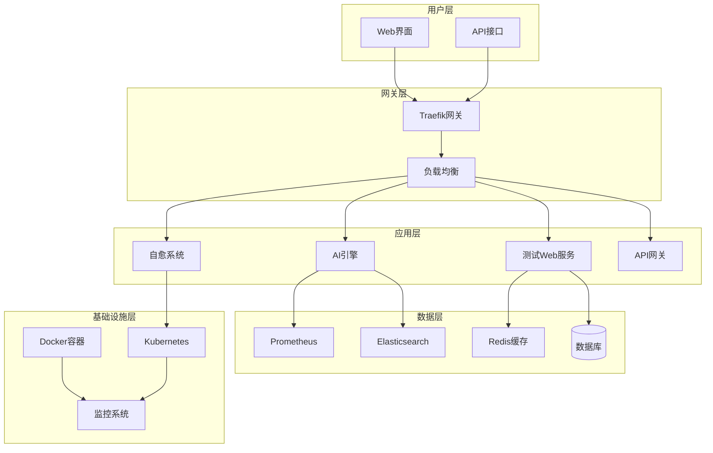
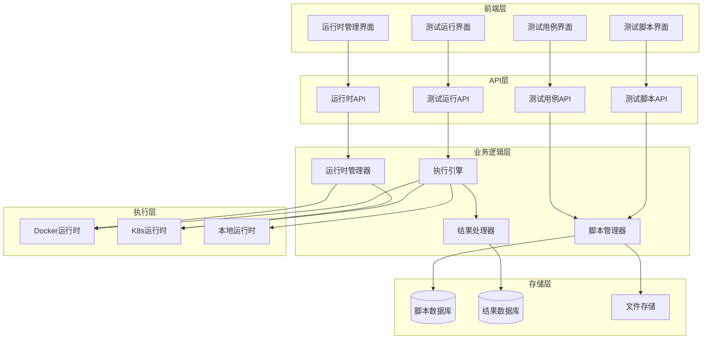
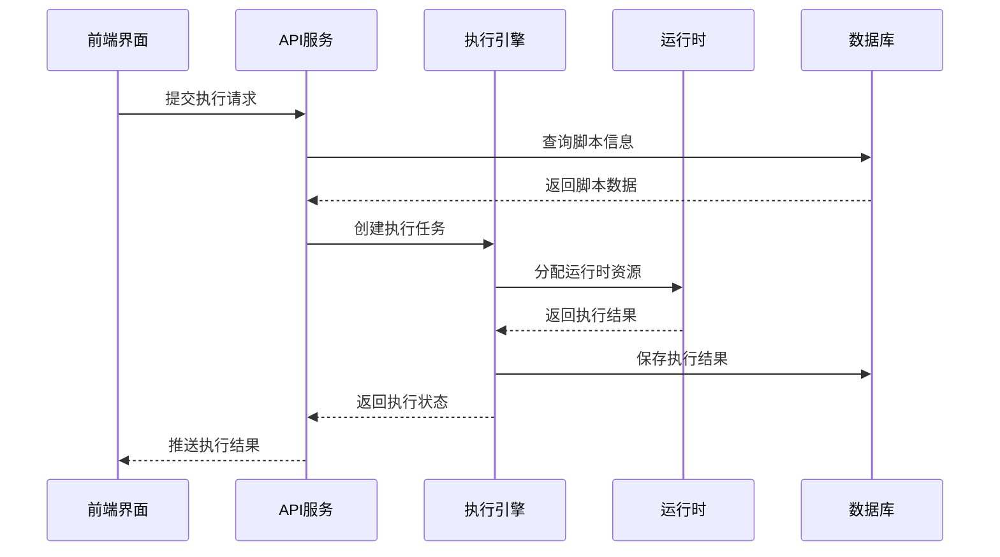
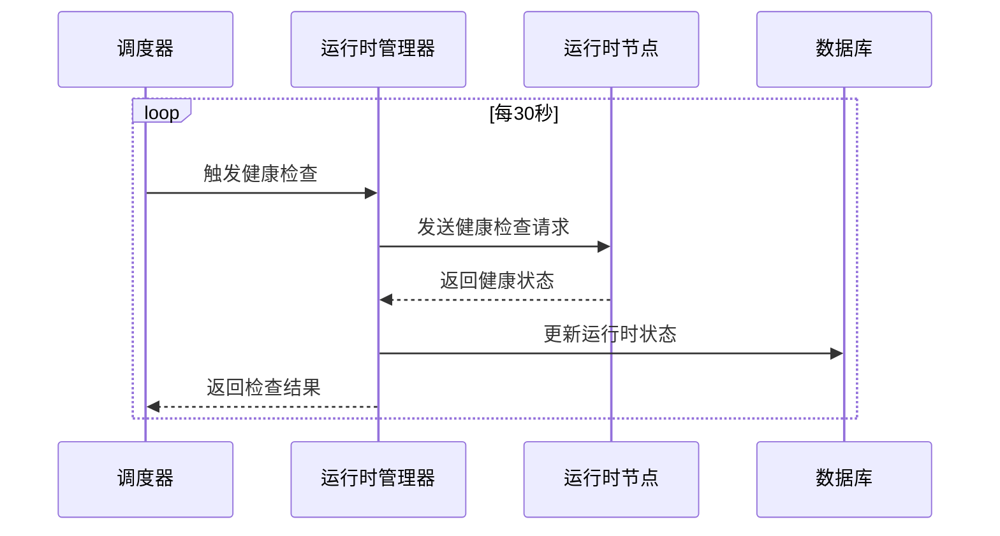

# AIOps平台系统架构文档

## 概述

AIOps平台是一个基于微服务架构的智能运维平台，集成了监控、日志分析、AI智能分析和自动化运维能力。本文档详细描述了系统的整体架构、组件设计和数据流。

## 系统架构图

### 整体架构



### 测试脚本管理系统架构



## 核心组件详解

### 1. 前端架构

#### 技术栈
- **框架**: Vue 3 + Composition API
- **路由**: Vue Router 4
- **状态管理**: Pinia
- **UI组件**: Element Plus
- **构建工具**: Vite
- **类型检查**: TypeScript

#### 组件结构
```
frontend/
├── src/
│   ├── components/          # 公共组件
│   │   ├── TagInput.vue    # 标签输入组件
│   │   └── ...
│   ├── views/              # 页面组件
│   │   ├── Dashboard.vue   # 仪表板
│   │   ├── TestCases.vue   # 测试用例管理
│   │   ├── TestScripts.vue # 测试脚本管理
│   │   ├── TestRuns.vue    # 测试运行管理
│   │   └── RuntimeManagers.vue # 运行时管理
│   ├── services/           # API服务
│   │   └── api.js         # API客户端
│   ├── router/            # 路由配置
│   └── stores/            # 状态管理
```

### 2. 后端架构

#### 技术栈
- **语言**: Rust
- **框架**: Axum
- **数据库**: SQLite/PostgreSQL
- **缓存**: Redis
- **容器**: Docker
- **编排**: Kubernetes

#### 服务结构
```
backend/
├── src/
│   ├── handlers/           # HTTP处理器
│   │   ├── test_cases.rs  # 测试用例处理
│   │   ├── test_scripts.rs # 测试脚本处理
│   │   ├── test_runs.rs   # 测试运行处理
│   │   └── runtime_managers.rs # 运行时处理
│   ├── models/            # 数据模型
│   ├── services/          # 业务逻辑
│   ├── database/          # 数据库操作
│   └── utils/             # 工具函数
```

### 3. 数据库设计

#### 核心表结构

**测试脚本表 (test_scripts)**
```sql
CREATE TABLE test_scripts (
    id INTEGER PRIMARY KEY,
    name VARCHAR(255) NOT NULL,
    description TEXT,
    language VARCHAR(50) NOT NULL,
    script_content TEXT NOT NULL,
    docker_image VARCHAR(255),
    timeout_seconds INTEGER DEFAULT 300,
    created_at TIMESTAMP DEFAULT CURRENT_TIMESTAMP,
    updated_at TIMESTAMP DEFAULT CURRENT_TIMESTAMP
);
```

**测试用例表 (test_cases)**
```sql
CREATE TABLE test_cases (
    id INTEGER PRIMARY KEY,
    name VARCHAR(255) NOT NULL,
    description TEXT,
    script_content TEXT NOT NULL,
    language VARCHAR(50) DEFAULT 'python',
    docker_image VARCHAR(255),
    timeout_seconds INTEGER DEFAULT 300,
    created_at TIMESTAMP DEFAULT CURRENT_TIMESTAMP,
    updated_at TIMESTAMP DEFAULT CURRENT_TIMESTAMP
);
```

**运行时管理器表 (runtime_managers)**
```sql
CREATE TABLE runtime_managers (
    id INTEGER PRIMARY KEY,
    name VARCHAR(255) NOT NULL,
    runtime_type VARCHAR(50) NOT NULL,
    endpoint VARCHAR(255) NOT NULL,
    status VARCHAR(50) DEFAULT 'unknown',
    tags TEXT,
    platform_info TEXT,
    created_at TIMESTAMP DEFAULT CURRENT_TIMESTAMP,
    updated_at TIMESTAMP DEFAULT CURRENT_TIMESTAMP
);
```

**测试运行表 (test_runs)**
```sql
CREATE TABLE test_runs (
    id INTEGER PRIMARY KEY,
    test_case_id INTEGER NOT NULL,
    runtime_manager_id INTEGER,
    status VARCHAR(50) DEFAULT 'pending',
    result TEXT,
    logs TEXT,
    started_at TIMESTAMP,
    completed_at TIMESTAMP,
    created_at TIMESTAMP DEFAULT CURRENT_TIMESTAMP,
    FOREIGN KEY (test_case_id) REFERENCES test_cases(id),
    FOREIGN KEY (runtime_manager_id) REFERENCES runtime_managers(id)
);
```

## 数据流设计

### 1. 测试脚本执行流程



### 2. 运行时健康检查流程



## 安全架构

### 1. 认证授权
- **JWT Token**: API访问认证
- **RBAC**: 基于角色的访问控制
- **API Key**: 服务间认证

### 2. 网络安全
- **TLS加密**: 所有HTTP通信使用HTTPS
- **网络隔离**: 不同服务使用独立网络
- **防火墙规则**: 限制端口访问

### 3. 数据安全
- **数据加密**: 敏感数据加密存储
- **访问日志**: 完整的操作审计
- **备份策略**: 定期数据备份

## 性能优化

### 1. 缓存策略
- **Redis缓存**: 热点数据缓存
- **浏览器缓存**: 静态资源缓存
- **CDN加速**: 全球内容分发

### 2. 数据库优化
- **索引优化**: 关键字段建立索引
- **查询优化**: SQL查询性能优化
- **连接池**: 数据库连接池管理

### 3. 并发处理
- **异步处理**: 非阻塞I/O操作
- **队列机制**: 任务队列处理
- **负载均衡**: 请求分发优化

## 监控告警

### 1. 系统监控
- **资源监控**: CPU、内存、磁盘使用率
- **服务监控**: 服务可用性和响应时间
- **业务监控**: 关键业务指标

### 2. 日志管理
- **集中日志**: ELK日志收集分析
- **日志分级**: 不同级别日志处理
- **日志轮转**: 自动日志清理

### 3. 告警机制
- **阈值告警**: 指标超阈值告警
- **异常告警**: 系统异常自动告警
- **通知渠道**: 邮件、短信、钉钉通知

## 部署架构

### 1. 容器化部署
```yaml
# Docker Compose 部署示例
version: '3.8'
services:
  frontend:
    build: ./frontend
    ports:
      - "3001:3000"
    depends_on:
      - backend
      
  backend:
    build: ./backend
    ports:
      - "3030:3030"
    depends_on:
      - database
      - redis
      
  database:
    image: postgres:13
    environment:
      POSTGRES_DB: aiops
      POSTGRES_USER: aiops
      POSTGRES_PASSWORD: password
    volumes:
      - postgres_data:/var/lib/postgresql/data
      
  redis:
    image: redis:6-alpine
    ports:
      - "6379:6379"
```

### 2. Kubernetes部署
```yaml
# Kubernetes 部署示例
apiVersion: apps/v1
kind: Deployment
metadata:
  name: aiops-backend
spec:
  replicas: 3
  selector:
    matchLabels:
      app: aiops-backend
  template:
    metadata:
      labels:
        app: aiops-backend
    spec:
      containers:
      - name: backend
        image: aiops/backend:latest
        ports:
        - containerPort: 3030
        env:
        - name: DATABASE_URL
          valueFrom:
            secretKeyRef:
              name: aiops-secrets
              key: database-url
```

## 扩展性设计

### 1. 水平扩展
- **无状态设计**: 服务无状态化
- **负载均衡**: 多实例负载分发
- **数据分片**: 大数据量分片存储

### 2. 垂直扩展
- **资源配置**: 动态资源调整
- **性能调优**: 应用性能优化
- **缓存优化**: 多级缓存策略

### 3. 功能扩展
- **插件机制**: 支持第三方插件
- **API开放**: 标准化API接口
- **微服务化**: 服务拆分和组合

## 总结

AIOps平台采用现代化的微服务架构，具备良好的可扩展性、可维护性和安全性。通过合理的架构设计和技术选型，能够满足企业级智能运维的需求，并为未来的功能扩展提供了坚实的基础。